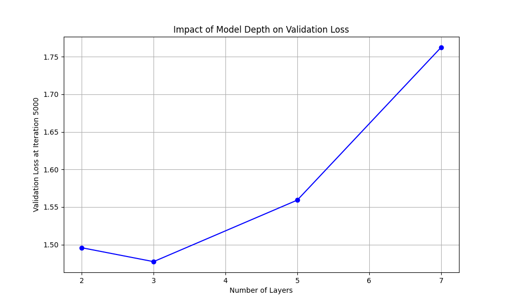

# NanoGPT Report

## Task 2: Shakespeare Character-level Model

Generated Shakespeare samples (first 5 lines):

```
KING RICHARD II:
Sweet Lord Hastings, was the army that world?

Messenger:
Nurse, I will determine, away!

KING RICHARD III:
```

## Task 3: Model Architecture Exploration



### Validation loss for different configurations:

- 2 layers, 4 heads: Loss = 1.4958
- 3 layers, 4 heads: Loss = 1.4773
- 5 layers, 4 heads: Loss = 1.5592
- 7 layers, 4 heads: Loss = 1.7624

### Best Configuration:

- Number of layers: 3
- Number of heads: 4
- Lowest validation loss: 1.4773

## Task 4: Code Generation

### Token count in code dataset:

- Total tokens: 146808
- Vocabulary size: 93

### Generated code samples (first 20 lines):

```python
If given, the case a do be a Tensor, optional in the range [0, 1]].

def __init__(
    self, out_features: int, bias: bool = True, device=None, dtype=None
    self.device, dtype

def forward(self, input: Tensor, target: Tensor) -> Tensor:
   return F.multi_margin_margin_margin_margin_label_margin

def ix_mak, inplace

class Linear UnitializedParameter Unitial Linear Units function elements and sets and :math:`KL(S)`, where :math:`N` is the batch size. If :attr:`

---------------

           ask_type = 1 self.in_proj_weight add none:
          constant_mask.view(
          attn_mask,
                    self.add_zero_attn,
                 self.ad_zero_attn,
              self.regist,
           self.reduction=self.reduction,
        )
```

### Most coherent generated code snippet:

```python
def forward(self, input: Tensor, target: Tensor) -> Tensor:
    return F.nll_loss(
        input, target, target, reduction=self.reduction
    )

class KLDivLoss(_Loss):
    r"""Creates a criterion that measures the loss. It In ditial
    This f constance between input tensors of the ran a scan be perationals in the class.
    This module of the finitial one ass for each sample. If reduction elements o addd its described in the paper `ReLU function` lay can be described as:
    """
```

Although the generated code demonstrates an understanding of structure, it contains numerous semantic flaws. Common issues include mismatches between function parameters and their usage within the function body, method calls that use incorrect or incompatible arguments, and function names that are nonsensical—such as "multi_margin_margin_margin_margin_label_margin." Additionally, the code often features incomplete or syntactically incorrect statements, further impacting its functionality and readability.
